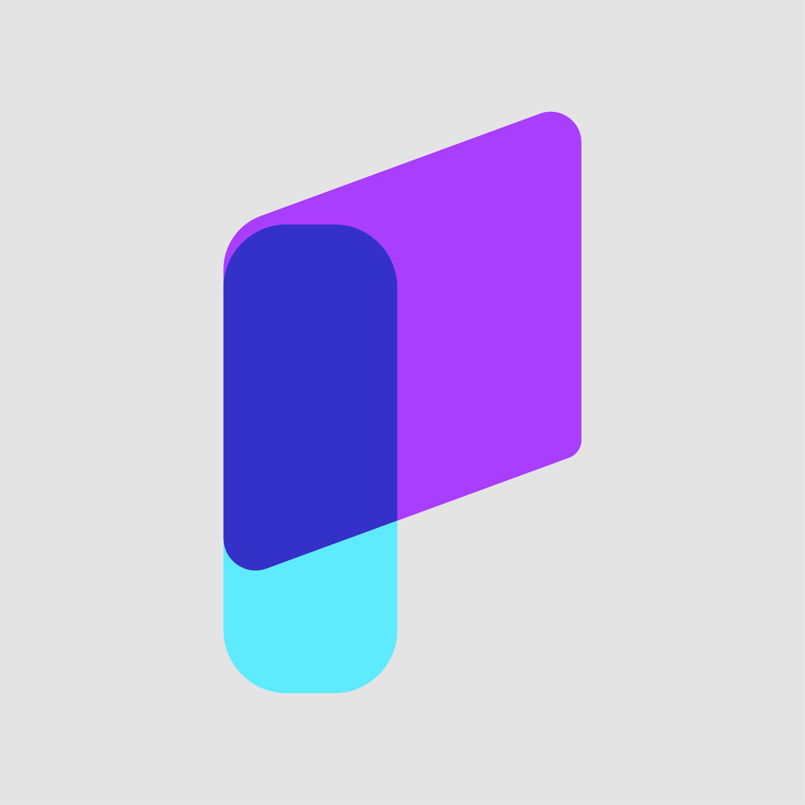
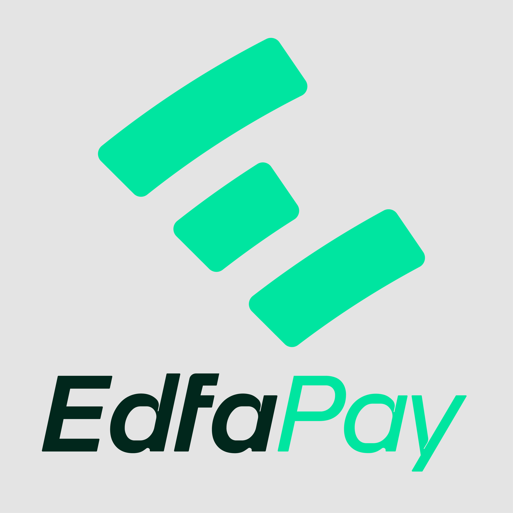
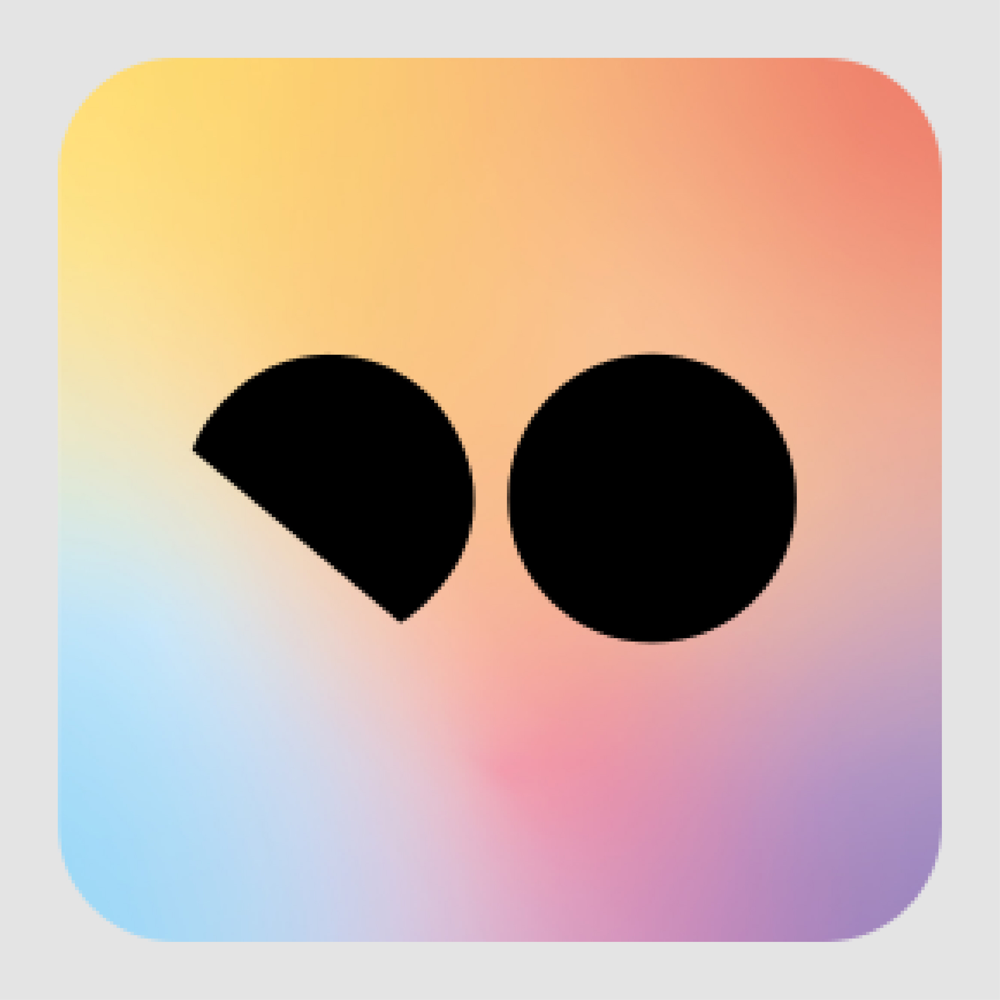
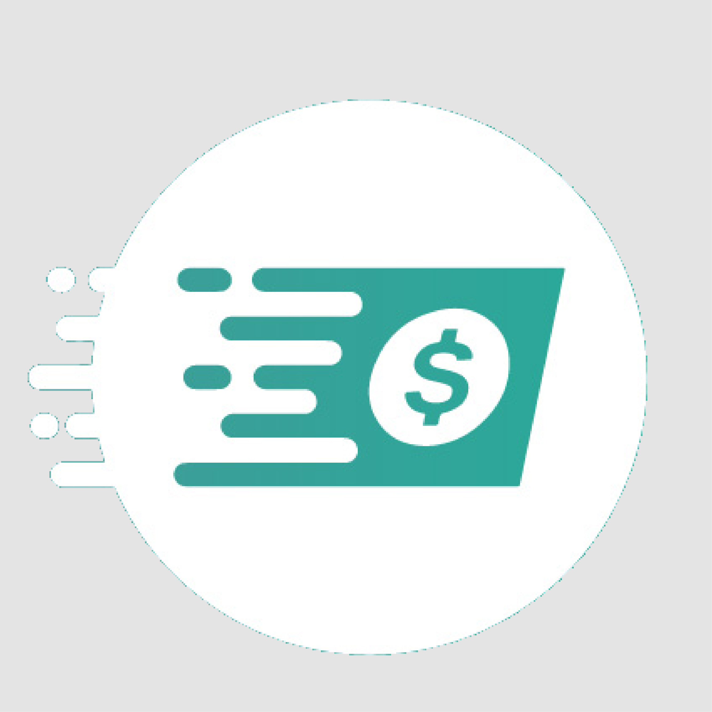
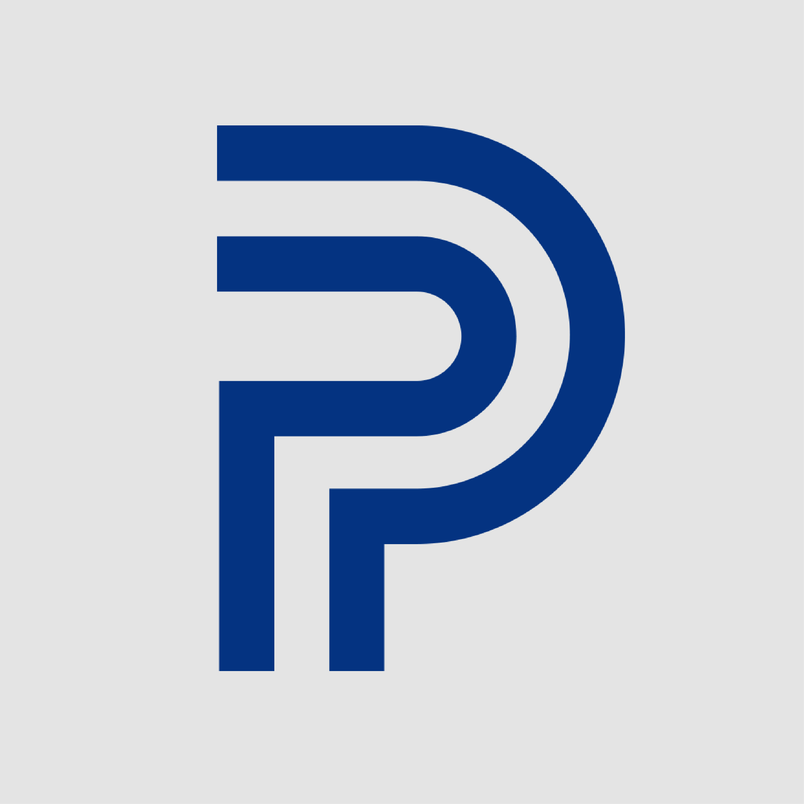
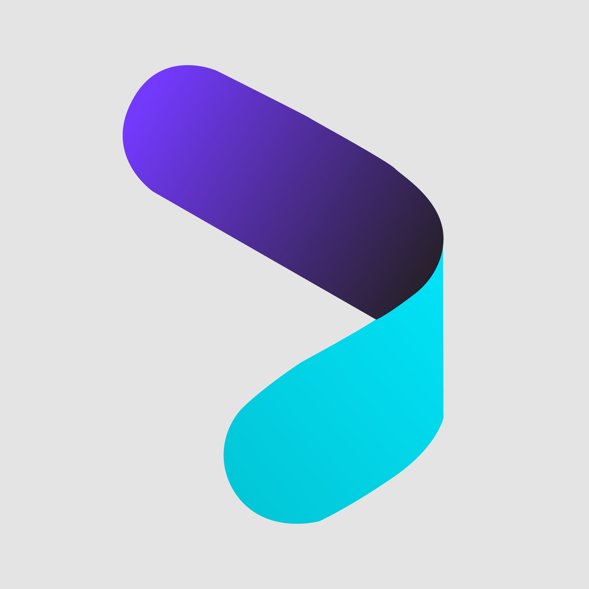
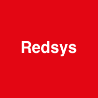

# Gateway Reference

Each gateway section below provides: configuration, full code example, and available sub-modules.

> **Back to [README](../README.md)**

---

## International

###  Stripe

| Property | Details |
|----------|--------|
| **Classes** | `StripeGateway`, `StripeCheckout`, `StripeCharge`, `StripeCustomer`, `StripeRefund`, `StripeWebhook` |
| **Authentication** | Secret Key (Bearer Token) |
| **Regions** | 46+ countries globally (USA, GBR, DEU, FRA, ARE, SAU, etc.) |
| **Currencies** | 135+ currencies (USD, EUR, GBP, SAR, AED, KWD, BHD, etc.) |
| **Features** | Checkout Sessions, Charges, PaymentIntents, Customers, Refunds |

```php
$gateway = PaymentGateway::stripe([
    'secret_key'     => 'sk_test_xxx',
    'webhook_secret' => 'whsec_xxx',   // Optional
    'testMode'       => true,
]);

$response = $gateway->purchase(new PaymentRequest(
    amount:      99.99,
    currency:    'USD',
    orderId:     'ORDER-001',
    description: 'Pro Subscription',
    callbackUrl: 'https://yoursite.com/webhook/stripe',
    returnUrl:   'https://yoursite.com/success',
    cancelUrl:   'https://yoursite.com/cancel',
    customer:    new Customer(name: 'John', email: 'john@example.com'),
));

// Sub-modules — full API coverage
$gateway->checkouts()->create($params);
$gateway->checkouts()->retrieve($sessionId);
$gateway->checkouts()->expire($sessionId);

$gateway->charges()->create($params);
$gateway->charges()->capture($chargeId);
$gateway->charges()->list(['limit' => 10]);

$gateway->customers()->create($data);
$gateway->customers()->update($id, $data);
$gateway->customers()->delete($id);

$gateway->refunds()->create(['payment_intent' => 'pi_xxx', 'amount' => 5000]);
$gateway->refunds()->retrieve($refundId);

$gateway->createPaymentIntent(['amount' => 5000, 'currency' => 'usd']);
$gateway->retrievePaymentIntent('pi_xxx');
```

---

###  PayPal

| Property | Details |
|----------|--------|
| **Classes** | `PayPalGateway`, `PayPalAuth`, `PayPalOrder`, `PayPalPayment`, `PayPalRefund`, `PayPalWebhook` |
| **Authentication** | Client ID + Client Secret (OAuth 2.0 Bearer Token) |
| **Regions** | 200+ countries globally |
| **Currencies** | 25+ currencies (USD, EUR, GBP, SAR, AED, KWD, BHD, etc.) |
| **Features** | Orders, Captures, Authorizations, Refunds, Webhooks |

```php
$gateway = PaymentGateway::paypal([
    'client_id'      => 'YOUR_CLIENT_ID',
    'client_secret'  => 'YOUR_CLIENT_SECRET',
    'webhook_id'     => 'YOUR_WEBHOOK_ID',
    'testMode'       => true,
]);

$response = $gateway->purchase(new PaymentRequest(
    amount:      99.99,
    currency:    'USD',
    orderId:     'ORDER-001',
    description: 'Pro Subscription',
    callbackUrl: 'https://yoursite.com/webhook/paypal',
    returnUrl:   'https://yoursite.com/success',
    cancelUrl:   'https://yoursite.com/cancel',
    customer:    new Customer(name: 'John', email: 'john@example.com'),
));

// After customer approves on PayPal, capture the order
$capture = $gateway->captureOrder($response->transactionId);

// Sub-modules
$gateway->orders()->create($params);
$gateway->orders()->retrieve($orderId);
$gateway->orders()->capture($orderId);
$gateway->orders()->authorize($orderId);

$gateway->payments()->showCapturedPayment($captureId);
$gateway->payments()->captureAuthorization($authId);
$gateway->payments()->voidAuthorization($authId);

$gateway->refunds()->create($captureId, ['amount' => ['value' => '10.00', 'currency_code' => 'USD']]);
$gateway->refunds()->retrieve($refundId);
```

---

## Middle East

###  MyFatoorah

| Property | Details |
|----------|---------|
| **Classes** | `MyFatoorahGateway`, `MyFatoorahSession`, `MyFatoorahInvoice`, `MyFatoorahCustomer`, `MyFatoorahWebhook` |
| **Authentication** | API Key (Bearer Token) — separate key per country |
| **Regions** | Kuwait, Saudi Arabia, UAE, Bahrain, Qatar, Oman, Egypt, Jordan |
| **Currencies** | KWD, SAR, AED, BHD, QAR, OMR, EGP, JOD |

```php
$gateway = PaymentGateway::myfatoorah([
    'api_key'  => 'YOUR_API_KEY',
    'country'  => 'SAU',
    'testMode' => true,
]);

$response = $gateway->purchase(new PaymentRequest(
    amount:      100.00,
    currency:    'SAR',
    orderId:     'ORDER-001',
    description: 'Premium Subscription',
    callbackUrl: 'https://yoursite.com/callback',
    customer:    new Customer(name: 'Ahmed', email: 'ahmed@example.com'),
));

$gateway->sessions()->create(100.00);
$gateway->customers()->getDetails($ref);
```

---

###  Paylink

| Property | Details |
|----------|---------|
| **Classes** | `PaylinkGateway`, `PaylinkAuth`, `PaylinkInvoice`, `PaylinkReconcile`, `PaylinkWebhook` |
| **Authentication** | API ID + Secret Key |
| **Region** | Saudi Arabia |
| **Currency** | SAR |

```php
$gateway = PaymentGateway::paylink([
    'api_id'     => 'YOUR_API_ID',
    'secret_key' => 'YOUR_SECRET_KEY',
    'testMode'   => true,
]);

$invoice = $gateway->createInvoice(new InvoiceRequest(
    amount: 250.00, currency: 'SAR', orderId: 'INV-001',
    callbackUrl: 'https://yoursite.com/callback',
    customer: new Customer(name: 'Mohammed', email: 'mohammed@example.com'),
    items: [['name' => 'Web Design', 'price' => 250.00, 'quantity' => 1]],
));

$gateway->reconcile()->getByDateRange($from, $to);
```

---

###  EdfaPay

| Property | Details |
|----------|---------|
| **Classes** | `EdfaPayGateway`, `EdfaPayCheckout`, `EdfaPayEmbedded`, `EdfaPayApplePay`, `EdfaPayHash`, `EdfaPayWebhook` |
| **Authentication** | Client Key + Password (HMAC signature) |
| **Regions** | Saudi Arabia, MENA |
| **Features** | Hosted Checkout, Server-to-Server, Apple Pay, Recurring, Auth/Capture |

```php
$gateway = PaymentGateway::edfapay([
    'client_key' => 'YOUR_CLIENT_KEY',
    'password'   => 'YOUR_SECRET_PASSWORD',
    'testMode'   => true,
]);

$response = $gateway->purchase(new PaymentRequest(...));

$gateway->embedded()->sale([...]);
$gateway->embedded()->authorize([...]);
$gateway->embedded()->capture($transId);
$gateway->applePay()->sale([...]);
```

---

###  Tap Payments

| Property | Details |
|----------|---------|
| **Classes** | `TapGateway`, `TapCharge`, `TapAuthorize`, `TapCustomer`, `TapInvoice`, `TapToken`, `TapWebhook` |
| **Authentication** | Secret Key (Bearer Token) |
| **Regions** | Kuwait, Saudi Arabia, UAE, Bahrain, Qatar, Oman, Egypt, Jordan |
| **Currencies** | KWD, SAR, AED, BHD, QAR, OMR, EGP |

```php
$gateway = PaymentGateway::tap([
    'secret_key'     => 'sk_test_xxx',
    'webhook_secret' => 'whsec_xxx',
    'testMode'       => true,
]);

$response = $gateway->purchase(new PaymentRequest(
    amount: 100.00, currency: 'SAR', orderId: 'ORDER-001',
    description: 'Premium Plan',
    callbackUrl: 'https://yoursite.com/callback',
    customer: new Customer(name: 'Ahmed', email: 'ahmed@example.com'),
));

$gateway->charges()->create($request);
$gateway->authorizations()->create($params);
$gateway->customers()->create($data);
$gateway->invoices()->create($data);
$gateway->tokens()->create($cardData);
```

---

###  ClickPay

| Property | Details |
|----------|---------|
| **Classes** | `ClickPayGateway`, `ClickPayTransaction`, `ClickPayWebhook` |
| **Authentication** | Server Key + Profile ID |
| **Regions** | SAU, ARE, EGY, OMN, JOR |

```php
$gateway = PaymentGateway::clickpay([
    'server_key' => 'YOUR_SERVER_KEY',
    'profile_id' => 'YOUR_PROFILE_ID',
    'region'     => 'SAU',
    'testMode'   => true,
]);

$response = $gateway->purchase(new PaymentRequest(...));
$gateway->transactions()->authorize($params);
$gateway->transactions()->capture($ref, 100.00);
$gateway->transactions()->void($ref, 100.00);
```

---

###  Tamara (BNPL)

| Property | Details |
|----------|---------|
| **Classes** | `TamaraGateway`, `TamaraCheckout`, `TamaraOrder`, `TamaraWebhook` |
| **Authentication** | API Token (Bearer) |
| **Type** | Buy Now Pay Later (Installments) |
| **Regions** | Saudi Arabia, UAE, Kuwait, Bahrain, Qatar |

```php
$gateway = PaymentGateway::tamara([
    'api_token' => 'YOUR_API_TOKEN',
    'testMode'  => true,
]);

$response = $gateway->purchase(new PaymentRequest(
    amount: 500.00, currency: 'SAR', orderId: 'ORD-001',
    callbackUrl: 'https://yoursite.com/callback',
    customer: new Customer(name: 'Sara', email: 'sara@example.com'),
    metadata: ['payment_type' => 'PAY_BY_INSTALMENTS'],
));

$gateway->orders()->authorise($orderId);
$gateway->orders()->capture($orderId, 500.00, 'SAR');
$gateway->orders()->cancel($orderId, 500.00);
$gateway->checkouts()->paymentOptions($orderData);
```

---

###  Thawani

| Property | Details |
|----------|---------|
| **Classes** | `ThawaniGateway`, `ThawaniSession`, `ThawaniCustomer`, `ThawaniWebhook` |
| **Authentication** | Secret Key + Publishable Key |
| **Region** | Oman exclusively |
| **Currency** | OMR (amounts converted to baisa: 1 OMR = 1000 baisa) |

```php
$gateway = PaymentGateway::thawani([
    'secret_key'      => 'YOUR_SECRET_KEY',
    'publishable_key' => 'YOUR_PUBLISHABLE_KEY',
    'testMode'        => true,
]);

$response = $gateway->purchase(new PaymentRequest(
    amount: 5.500, currency: 'OMR', orderId: 'ORD-001',
    callbackUrl: 'https://yoursite.com/callback',
));

$gateway->sessions()->retrieve($sessionId);
$gateway->customers()->create($data);
$gateway->createPaymentIntent(5500, 'ref-001', $paymentMethodId, $returnUrl);
```

---

###  Fatora

| Property | Details |
|----------|---------|
| **Classes** | `FatoraGateway`, `FatoraCheckout`, `FatoraRecurring`, `FatoraWebhook` |
| **Authentication** | API Key |
| **Regions** | SAU, ARE, QAT, BHR, KWT, OMN, IRQ, JOR, EGY |
| **Special** | Card tokenization for recurring payments |

```php
$gateway = PaymentGateway::fatora([
    'api_key'  => 'YOUR_API_KEY',
    'testMode' => true,
]);

$response = $gateway->purchase(new PaymentRequest(
    amount: 50.00, currency: 'SAR', orderId: 'ORD-001',
    callbackUrl: 'https://yoursite.com/callback',
    metadata: ['save_token' => true],
));

$gateway->recurring(new PaymentRequest(
    amount: 50.00, currency: 'SAR', orderId: 'REC-001',
    recurringToken: $response->recurringToken,
));

$gateway->checkouts()->verify($orderId);
$gateway->recurringPayments()->deactivateToken($token);
```

---

###  Payzaty

| Property | Details |
|----------|---------|
| **Classes** | `PayzatyGateway`, `PayzatyCheckout`, `PayzatyWebhook` |
| **Authentication** | X-AccountNo + X-SecretKey headers |
| **Region** | Saudi Arabia |
| **Payment Methods** | Mada, VISA, MasterCard, Apple Pay, STC Pay |

```php
$gateway = PaymentGateway::payzaty([
    'account_no' => 'YOUR_ACCOUNT_NO',
    'secret_key' => 'YOUR_SECRET_KEY',
    'testMode'   => true,
]);

$response = $gateway->purchase(new PaymentRequest(
    amount: 200.00, currency: 'SAR', orderId: 'ORD-001',
    callbackUrl: 'https://yoursite.com/callback',
));

$gateway->checkouts()->status($paymentId);
```

---

###  Payzah

| Property | Details |
|----------|---------|
| **Classes** | `PayzahGateway`, `PayzahPayment`, `PayzahWebhook` |
| **Authentication** | Private Key |
| **Region** | Kuwait |
| **Payment Methods** | K-Net, VISA, MasterCard, Apple Pay, Amex |

```php
$gateway = PaymentGateway::payzah([
    'private_key' => 'YOUR_PRIVATE_KEY',
    'testMode'    => true,
]);

$response = $gateway->purchase(new PaymentRequest(
    amount: 15.000, currency: 'KWD', orderId: 'ORD-001',
    callbackUrl: 'https://yoursite.com/callback',
    metadata: ['payment_method' => 'knet'],
));

$gateway->payments()->status($paymentId);
```

---

###  NeonPay

| Property | Details |
|----------|--------|
| **Classes** | `NeonPayGateway`, `NeonPayPayment`, `NeonPayWebhook` |
| **Authentication** | EBIK Key (X-EBIK-KEY header) |
| **Regions** | Saudi Arabia, UAE, Bahrain, Qatar, Kuwait, Oman, Egypt, Jordan |
| **Currencies** | SAR, AED, BHD, QAR, KWD, OMR, EGP, JOD |

```php
$gateway = PaymentGateway::neonpay([
    'ebik_key' => 'YOUR_64_CHAR_EBIK_KEY',
    'testMode' => true,
]);

$response = $gateway->purchase(new PaymentRequest(
    amount: 150.00, currency: 'SAR', orderId: 'ORDER-001',
    description: 'Premium Subscription',
    callbackUrl: 'https://yoursite.com/webhook/neonpay',
    returnUrl:   'https://yoursite.com/success',
));

$gateway->payments()->retrieve($paymentToken);
$gateway->payments()->list(['status' => 'completed']);
$gateway->payments()->refund($paymentToken);
$gateway->healthCheck();
$gateway->validateKey();
```

---

###  AsiaPay (Iraq)

| Property | Details |
|----------|--------|
| **Classes** | `AsiaPayGateway`, `AsiaPayAuth`, `AsiaPayOrder`, `AsiaPayWebhook` |
| **Authentication** | App Key + App Secret + Private Key (JWT) |
| **Region** | Iraq |
| **Currency** | IQD |

```php
$gateway = PaymentGateway::asiapay([
    'app_key'     => 'YOUR_APP_KEY',
    'app_secret'  => 'YOUR_APP_SECRET',
    'private_key' => 'YOUR_PRIVATE_KEY',
    'app_id'      => 'YOUR_APP_ID',
    'merch_code'  => 'YOUR_MERCHANT_CODE',
    'testMode'    => true,
]);

$response = $gateway->purchase(new PaymentRequest(
    amount: 1250.000, currency: 'IQD', orderId: 'ORDER-001',
    description: 'Product Purchase',
    callbackUrl: 'https://yoursite.com/webhook/asiapay',
    returnUrl:   'https://yoursite.com/success',
));

$gateway->orders()->queryOrder($params);
$gateway->orders()->refund($params);
```

---

###  ZainCash (Iraq)

| Property | Details |
|----------|--------|
| **Classes** | `ZainCashGateway`, `ZainCashTransaction`, `ZainCashWebhook` |
| **Authentication** | Merchant ID + Secret (JWT HS256) |
| **Region** | Iraq |
| **Currency** | IQD (minimum 250 IQD) |

```php
$gateway = PaymentGateway::zaincash([
    'msisdn'      => '9647835077893',
    'merchant_id' => 'YOUR_MERCHANT_ID',
    'secret'      => 'YOUR_SECRET_KEY',
    'testMode'    => true,
]);

$response = $gateway->purchase(new PaymentRequest(
    amount: 5000, currency: 'IQD', orderId: 'ORDER-001',
    callbackUrl: 'https://yoursite.com/callback',
    returnUrl:   'https://yoursite.com/success',
));

$gateway->transactions()->get($params);
```

---

## Europe

###  Mollie

| Property | Details |
|----------|--------|
| **Classes** | `MollieGateway`, `MolliePayment`, `MollieRefund`, `MollieCustomer`, `MollieWebhook` |
| **Authentication** | API Key (Bearer Token) |
| **Regions** | Netherlands, Germany, France, Belgium, Austria, UK, Spain, Portugal + 20 more |
| **Currencies** | EUR, GBP, USD, CHF, SEK, NOK, DKK, PLN, CZK + more |
| **Features** | Payments, Refunds, Customers, iDEAL, Bancontact, SEPA, Klarna, Giropay |

```php
$gateway = PaymentGateway::mollie([
    'api_key'  => 'test_xxxxxxxxxxxxxxxxxxxxxxxx',
    'locale'   => 'de_DE',
    'testMode' => true,
]);

$response = $gateway->purchase(new PaymentRequest(
    amount:      29.99,
    currency:    'EUR',
    orderId:     'ORDER-001',
    description: 'Premium Subscription',
    callbackUrl: 'https://yoursite.com/webhook/mollie',
    returnUrl:   'https://yoursite.com/success',
    cancelUrl:   'https://yoursite.com/cancel',
));

$gateway->payments()->create($params);
$gateway->payments()->retrieve($id);
$gateway->payments()->list(['limit' => 10]);

$gateway->refunds()->create($paymentId, $params);
$gateway->refunds()->retrieve($paymentId, $refundId);

$gateway->customers()->create($data);
$gateway->customers()->retrieve($id);
$gateway->customers()->update($id, $data);
$gateway->customers()->delete($id);
```

---

###  Redsys (Spain)

| Property | Details |
|----------|--------|
| **Classes** | `RedsysGateway`, `RedsysTransaction`, `RedsysWebhook` |
| **Authentication** | Merchant Key (3DES + HMAC-SHA256) |
| **Regions** | Spain, Portugal, Andorra |
| **Currency** | EUR |

```php
$gateway = PaymentGateway::redsys([
    'merchant_code' => 'YOUR_MERCHANT_CODE',
    'merchant_key'  => 'YOUR_BASE64_MERCHANT_KEY',
    'terminal'      => '1',
    'testMode'      => true,
]);

$response = $gateway->purchase(new PaymentRequest(
    amount:      49.99,
    currency:    'EUR',
    orderId:     'ORDER-001',
    description: 'Online Purchase',
    callbackUrl: 'https://yoursite.com/webhook/redsys',
    returnUrl:   'https://yoursite.com/success',
    cancelUrl:   'https://yoursite.com/cancel',
));

$gateway->transactions()->restRequest($params);
```

---

###  GoCardless (UK)

| Property | Details |
|----------|--------|
| **Classes** | `GoCardlessGateway`, `GoCardlessPayment`, `GoCardlessMandate`, `GoCardlessRefund`, `GoCardlessWebhook` |
| **Authentication** | Access Token (Bearer) |
| **Regions** | UK, Germany, France, Spain, Netherlands, Australia, USA, Canada + more |
| **Currencies** | GBP, EUR, SEK, DKK, AUD, NZD, CAD, USD |
| **Type** | Direct Debit (recurring bank-to-bank payments) |

```php
$gateway = PaymentGateway::gocardless([
    'access_token'   => 'YOUR_ACCESS_TOKEN',
    'webhook_secret' => 'YOUR_WEBHOOK_SECRET',
    'testMode'       => true,
]);

$response = $gateway->purchase(new PaymentRequest(
    amount: 29.99, currency: 'GBP', orderId: 'ORDER-001',
    description: 'Monthly Subscription',
    metadata: ['mandate_id' => 'MD000xxxxx'],
));

$gateway->payments()->create($params);
$gateway->payments()->retrieve($id);
$gateway->payments()->cancel($id);
$gateway->payments()->retry($id);

$gateway->mandates()->create($data);
$gateway->mandates()->retrieve($id);
$gateway->mandates()->cancel($id);

$gateway->refunds()->create($params);
$gateway->refunds()->retrieve($id);
```
